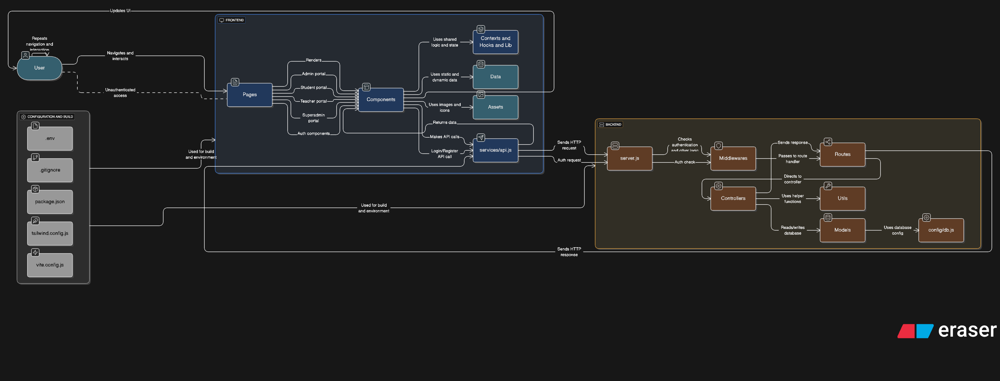
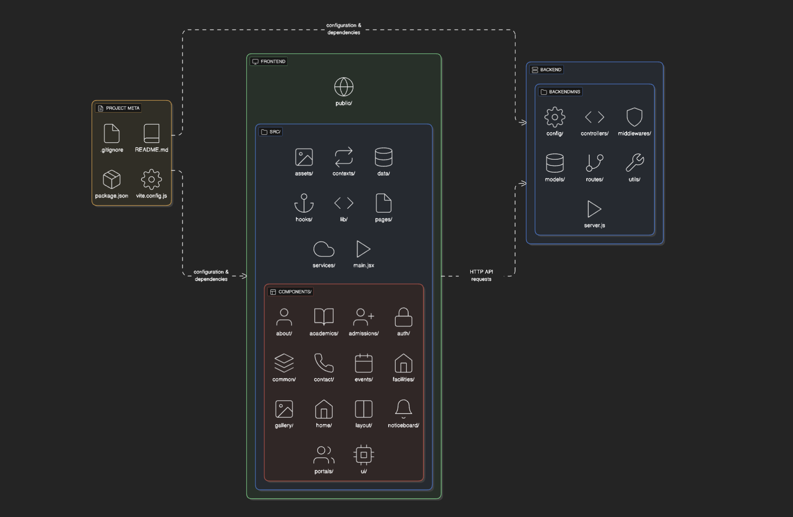

# Mansarovar Public School Website

<div align="center">
  
  <h3>Excellence in Education Since 1995</h3>
  <p>A modern, full-stack web application for Mansarovar Public School</p>
</div>

## 📋 Table of Contents

- [Overview](#overview)
- [Features](#features)
- [Tech Stack](#tech-stack)
- [Project Structure](#project-structure)
- [Getting Started](#getting-started)
- [Environment Variables](#environment-variables)
- [API Documentation](#api-documentation)
- [Contributing](#contributing)
- [License](#license)
- [Contact](#contact)

## 🌟 Overview

This project is a comprehensive school management system and website for Mansarovar Public School, designed to serve various stakeholders including students, parents, teachers, and administrators. The application includes both public-facing pages and authenticated portals for different user types.

### 🏗️ System Architecture

<div align="center">
  
  <p><em>High-level system architecture showing frontend, backend, and database layers</em></p>
</div>

### 📊 Project Flow Diagram

<div align="center">
  
  <p><em>User flow and data architecture diagram</em></p>
</div>

## ✨ Features

### Public Pages
- **Home**: Dynamic homepage showcasing school highlights, announcements, upcoming events
- **About**: Detailed information about the school's history, mission, vision, and leadership
- **Academics**: Overview of academic programs, curriculum, and teaching methodology
- **Admissions**: Application process, eligibility criteria, fee structure, and documents required
- **Facilities**: Showcase of school infrastructure and facilities
- **Gallery**: Visual showcase of school events and activities
- **Events**: Calendar of upcoming and past events with details
- **NoticeBoard**: Important announcements and notifications
- **Contact**: Contact information and inquiry form

### Authenticated Portals
- **Student Portal**: Attendance, grades, assignments, timetable, and fee details
- **Parent Portal**: Monitor child's progress, attendance, and fee payment
- **Teacher Portal**: Manage classes, upload assignments, record attendance, grade students
- **Admin Portal**: Complete school management system with user management

## 🛠️ Tech Stack

### Frontend
- **Framework**: React 18+
- **Build Tool**: Vite
- **Styling**: Tailwind CSS
- **Routing**: React Router v6
- **State Management**: Context API
- **Form Handling**: React Hook Form

### Backend
- **Server**: Node.js with Express
- **Database**: MongoDB with Mongoose
- **Authentication**: JWT (JSON Web Tokens)
- **API Format**: RESTful API
- **Image Storage**: Cloudinary

### Development Tools
- **Formatting**: ESLint, Prettier
- **Version Control**: Git
- **Environment**: dotenv

## 📁 Project Structure

The project follows a modular architecture for better organization and maintainability:

```
src/
├── api/             # API endpoints and services
├── assets/          # Static resources (images, icons)
├── components/      # Reusable UI components grouped by feature
├── config/          # Configuration files
├── contexts/        # React Context providers
├── controllers/     # API controllers
├── data/            # Static data and sample content
├── hooks/           # Custom React hooks
├── middlewares/     # Express middlewares
├── models/          # Mongoose models
├── pages/           # Page components
├── routes/          # API routes
├── services/        # Service layer
└── utils/           # Utility functions
```

## 🚀 Getting Started

### Prerequisites

- Node.js (v14.x or later)
- npm or yarn
- MongoDB

### Installation

1. Clone the repository:
   ```bash
   git clone https://github.com/yourusername/manosarovarpublicschool.git
   cd manosarovarpublicschool
   ```

2. Install dependencies:
   ```bash
   npm install
   # or
   yarn
   ```

3. Set up environment variables:
   ```bash
   cp .env.example .env
   # Edit .env with your configuration
   ```

4. Start the development server:
   ```bash
   npm run dev
   # or
   yarn dev
   ```

5. Open your browser and navigate to `http://localhost:5173`

### Build for Production

```bash
npm run build
# or
yarn build
```

## 🔐 Environment Variables

Create a `.env` file in the root directory with the following variables:

```env
# Server Configuration
PORT=5000
NODE_ENV=development

# MongoDB Configuration
MONGODB_URI=mongodb://localhost:27017/mansarovar-school

# JWT Authentication
JWT_SECRET=your_jwt_secret_key
JWT_EXPIRE=30d

# Cloudinary Configuration (for image uploads)
CLOUDINARY_CLOUD_NAME=your_cloud_name
CLOUDINARY_API_KEY=your_api_key
CLOUDINARY_API_SECRET=your_api_secret
```

## 📚 API Documentation

The API follows RESTful conventions and is organized into the following endpoints:

- **Auth**: `/api/auth` - User authentication
- **Users**: `/api/users` - User management
- **Students**: `/api/students` - Student-specific operations
- **Teachers**: `/api/teachers` - Teacher-specific operations
- **Events**: `/api/events` - School events
- **Gallery**: `/api/gallery` - School photos and media
- **Notices**: `/api/notices` - School announcements

For detailed API documentation, refer to the Postman collection in the `docs` folder.

## 👥 Contributing

Contributions are welcome! Please feel free to submit a Pull Request.

1. Fork the repository
2. Create a feature branch: `git checkout -b feature-name`
3. Commit your changes: `git commit -m 'Add some feature'`
4. Push to the branch: `git push origin feature-name`
5. Open a Pull Request

## 📄 License

This project is licensed under the MIT License - see the LICENSE file for details.

## 📞 Contact

For any inquiries about the project, please contact:

- **Developer**: Your Name
- **Email**: youremail@example.com
- **School Website**: [www.mansarovarpublicschool.edu.in](http://www.mansarovarpublicschool.edu.in)

---

<div align="center">
  <p>© 2025 Mansarovar Public School. All rights reserved.</p>
</div>
